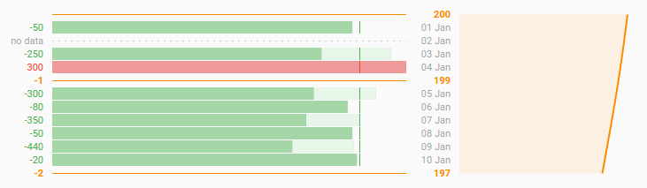

# fitness-timeline-d3

A [reusable chart](http://bost.ocks.org/mike/chart/) for displaying a sequence
of calorie/weight measurements.

There is a [live demo using the author's personal data](http://fitness.labs.vreon.net).
Make sure to pester him if you notice he has fallen off the wagon. ;)



## Usage

```javascript
var data = [
    {"type": "weight", "goal": 180, "value": 200},
    {"type": "diary", "date": "2015-01-01", "goal": 2000, "food": 1950, "exercise": 0},
    {"type": "lacuna", "date": "2015-01-02"},
    {"type": "diary", "date": "2015-01-03", "goal": 2000, "food": 2200, "exercise": 450},
    {"type": "diary", "date": "2015-01-04", "goal": 2000, "food": 2300, "exercise": 200},
    {"type": "weight", "goal": 180, "value": 199},
    {"type": "diary", "date": "2015-01-05", "goal": 2000, "food": 2100, "exercise": 400},
    {"type": "diary", "date": "2015-01-06", "goal": 2000, "food": 1920, "exercise": 0},
    {"type": "diary", "date": "2015-01-07", "goal": 2000, "food": 2000, "exercise": 350},
    {"type": "diary", "date": "2015-01-08", "goal": 2000, "food": 1950, "exercise": 0},
    {"type": "diary", "date": "2015-01-09", "goal": 2000, "food": 1960, "exercise": 400},
    {"type": "diary", "date": "2015-01-10", "goal": 2000, "food": 1980, "exercise": 0},
    {"type": "weight", "goal": 180, "value": 197}
];

var chart = fitnessTimeline();
var svg = d3.select("body").append("svg")
    .attr("class", "chart")
    .datum(data)
    .call(chart);
```

## Configuration

* `showNet`: toggle display of the "net" column, default `true`.
* `showBar`: toggle display of the "bar" column, default `true`.
* `showDate`: toggle display of the "date" column, default `true`.
* `showGraph`: toggle display of the "graph" column, default `true`.
* `netWidth`: width of the "net" column, default `40`.
* `barWidth`: width of the "bar" column, default `400`.
* `dateWidth`: width of the "date" column, default `40`.
* `graphWidth`: width of the "graph" column, default `190`.
* `columnMargin`: space between columns, default `10`.
* `entryHeight`: height of each entry row, default `15`.
